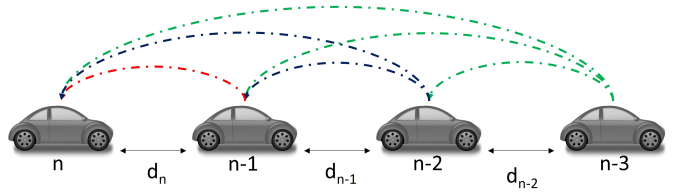

# Communication-Aware Cooperative Adaptive Cruise Control (CACC)
### MPC-Based Cooperative Driving under Communication Loss and Control-Centric Communication

---

## Overview

This project investigates **cooperative autonomous driving systems** under **non-ideal communication conditions**, focusing on:

- Cooperative Adaptive Cruise Control (CACC)
- Vehicle platooning
- Communication-aware control strategies

Using a **Model Predictive Control (MPC)** framework, the system evaluates how **packet loss, communication frequency, and transmission strategies** impact performance, stability, and safety in multi-vehicle systems.

---

## Motivation

Traditional Adaptive Cruise Control (ACC):
- Relies only on onboard sensors  
- Suffers from delayed response propagation  
- Becomes **string unstable** in long vehicle chains  

Cooperative systems (CACC and platooning):
- Use **Vehicle-to-Vehicle (V2V)** communication  
- Improve responsiveness and traffic flow  
- Enable tighter and more efficient vehicle spacing  

However:
- Communication is **lossy and unreliable**  
- High communication rates lead to **network congestion**  

👉 This project addresses:

> How to design **robust control systems under communication loss** and  
> how to **reduce communication without degrading performance**

---

## System Architecture

### Cooperative Driving Topology (CACC)

  

- Vehicles receive information from multiple predecessors (APLF topology)
- Combines:
  - Local sensing (radar)
  - V2V communication
- Enables faster disturbance propagation and improved stability

---

### Vehicle Model (Bicycle Model)

  

- Simplified dynamic model for control design
- States include:
  - Velocity, position, and heading
- Inputs:
  - Acceleration
  - Steering angle
- Used for MPC prediction over a finite horizon

---

## Control Framework

### Adaptive Cruise Control (ACC)
- No communication
- Delayed disturbance propagation
- Poor scalability

---

### Cooperative Adaptive Cruise Control (CACC)
- Uses V2V communication
- Faster response to leader behavior
- Improved string stability

---

### Platooning
- Constant distance policy
- Higher efficiency
- More sensitive to communication loss

---

## Communication Model

- Packet delivery modeled as an **i.i.d. random process**
- Packet Error Rate (PER): 0 → 0.6
- Communication rate: ~10 Hz baseline

If communication fails:
- Vehicles use last received data  
- Assume constant-speed evolution until next update  

---

## MPC Formulation

Control objectives:

- Collision avoidance (hard constraint)
- Speed tracking
- Passenger comfort (bounded acceleration)

The problem is solved as a **constrained optimization problem** at each time step using MPC.

---

## Control-Centric Communication (Extension)

To reduce communication overhead, this project incorporates:

### Event-Triggered Communication (ETC)
- Transmit only when necessary  
- Avoids redundant periodic updates  

### Model-Based Communication (MBC)
- Transmit **models instead of raw data**  
- Uses Gaussian Process (GP) to predict vehicle behavior  

### Key Result
- ~47% reduction in communication frequency  
- <1% degradation in tracking performance  

👉 Demonstrates that communication can be optimized without sacrificing control quality

---

## Key Insights

- Cooperation significantly improves traffic flow and responsiveness  
- Communication loss directly impacts control performance  
- CACC is more robust than tightly coupled platooning  
- Event-triggered communication reduces network load effectively  

---

## Tech Stack

- Python / MATLAB  
- Model Predictive Control (MPC)  
- Optimization solvers (e.g., CVXPY)  
- Gaussian Process modeling  

---

## Publications

- *Impact of Communication Loss on MPC-Based CACC and Platooning* — IEEE VTC 2021  
- *Optimized Control-Centric Communication in CACC Systems* — IEEE VTC 2024  

---

## Author

Shahriar Shahram  
PhD Candidate — Electrical & Computer Engineering  
University of Central Florida  

---

## Notes

This project focuses on **multi-agent cooperative control under communication uncertainty**, complementing energy-aware control frameworks for autonomous driving.
